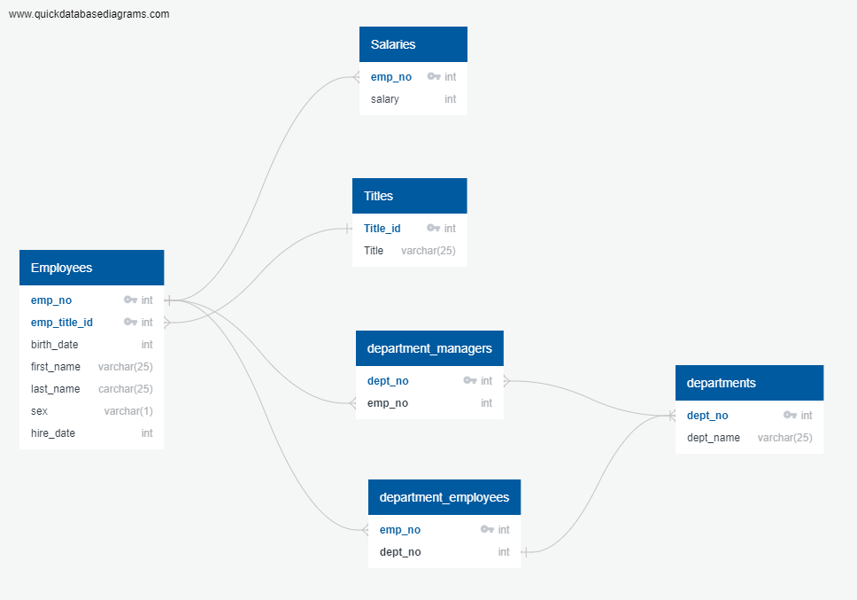

# SQL Challenge

#  ERD was used to Vizualize the relationships(connections of the data) Helped with seeing which tables needed to be joined and which columns to call and where it was needed to call them to display what was instructed.